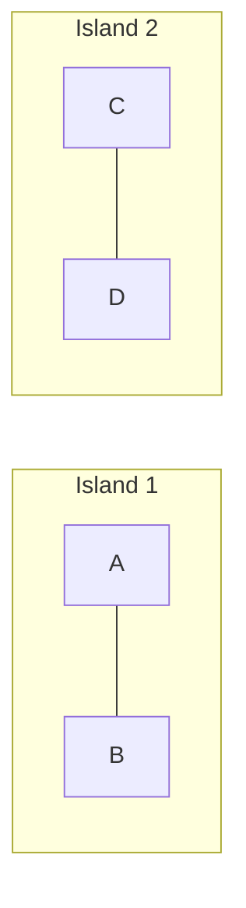

# Filterable HNSW: How Qdrant Solves Vector Search with Filters

> A deep dive into the algorithm that makes filtered similarity search fast and accurate

---

## The Real-World Problem

You're building a product search engine. A user asks: *"Show me laptops similar to this one, under $1,000, from Apple or Dell."*

This query has two parts:
1. **Vector similarity**: Find products with similar embeddings to the query
2. **Metadata filtering**: Only return items matching specific criteria

Modern vector databases use **HNSW** (Hierarchical Navigable Small World) graphs for fast similarity search. But HNSW was designed for unfiltered search. When you add filters, things break in subtle and dangerous ways.

This tutorial explains exactly why, and how Qdrant's **filterable HNSW** algorithm solves it.

---

## Part 1: Graph Theory Fundamentals

Before diving into HNSW, we need to understand what graphs are and why connectivity matters.

### What is a Graph?

A **graph** is a mathematical structure consisting of **nodes** (points) connected by **edges** (lines). Think of it like a subway map: stations are nodes, tracks are edges.

<div align="center">

```
    ┌───┐         ┌───┐         ┌───┐
    │ A │─────────│ B │─────────│ C │
    └───┘         └───┘         └───┘
      │             │             │
      │             │             │
    ┌───┐         ┌───┐         ┌───┐
    │ D │─────────│ E │─────────│ F │
    └───┘         └───┘         └───┘
```

</div>

**Key properties:**

| Term | Definition | Subway Analogy |
|------|------------|----------------|
| Node | A data point in the graph | A station |
| Edge | A connection between two nodes | A track between stations |
| Path | A sequence of edges connecting two nodes | Your route from A to F |
| Connected | Any node reachable from any other | You can get anywhere |

### Why Connectivity Matters

A graph is **connected** if you can reach any node from any other by following edges. If not, the graph has **disconnected components**—isolated islands with no path between them.

<div align="center">

**Connected Graph**
```
    ┌───┐         ┌───┐         ┌───┐
    │ A │─────────│ B │─────────│ C │
    └───┘         └───┘         └───┘
      │             │             │
      └─────────────┼─────────────┘
                    │
                  ┌───┐
                  │ D │
                  └───┘
```
*Any node reachable from any other*

**Disconnected Graph**



*No path from A to C—they're on different islands*

</div>

This distinction becomes critical when we start removing nodes from a graph.

---

## Part 2: How HNSW Works

HNSW is a graph-based algorithm for approximate nearest neighbor search. Understanding it requires two key intuitions.

### Intuition 1: The Navigation Graph

Imagine you're dropped in a foreign city and need to find the best coffee shop. You have two strategies:

**Strategy A (Brute Force):**
Visit every coffee shop in the city, rate each one, pick the best.
- ✅ Guaranteed to find the best
- ❌ Takes forever (O(n) time)

**Strategy B (Ask Locals):**
1. Ask someone nearby: "Where's good coffee?" They point you to a neighborhood.
2. Go there, ask again—they point you closer.
3. Keep following recommendations until you converge on the answer.
- ✅ Fast (O(log n) time)
- ❌ Might miss the absolute best (approximate)

**HNSW implements Strategy B.** It builds a graph where each data point connects to its most similar neighbors. To search, you start somewhere and "hop" through the graph, always moving toward more similar items.

<div align="center">

```
Search Path: Finding the nearest neighbor to Q (query)

         Start
           │
           ▼
        ┌─────┐                    ┌─────┐
        │  A  │───────────────────▶│  B  │
        └─────┘                    └─────┘
                                      │
                              closer to Q
                                      │
                                      ▼
        ┌─────┐       ┌─────┐     ┌─────┐
        │  E  │◀──────│  D  │◀────│  C  │
        └─────┘       └─────┘     └─────┘
           │
      even closer
           │
           ▼
        ┌─────┐       ┌─────┐
        │  F  │──────▶│  ★  │ ◀── Result!
        └─────┘       │  Q  │
                      └─────┘
```

**</div>

At each step, the algorithm examines neighbors of the current node and jumps to whichever is closest to the query. This greedy traversal typically finds excellent matches in logarithmic time.

### Intuition 2: The Hierarchical Layers

The "H" in HNSW stands for **Hierarchical**. The graph has multiple layers, like zooming in on a map:

<div align="center">

```
LAYER 2 (Express)     A═══════════════════════════E      ← Few nodes, long-range edges
Few nodes             ┆                           ┆
                      ┆                           ┆
LAYER 1 (Local)       A───────B───────C───────D───E      ← More nodes, medium edges
More nodes            ┆       ┆       ┆       ┆   ┆
                      ┆       ┆       ┆       ┆   ┆
LAYER 0 (Street)      A───a───B───b───C───c───D───d───E  ← All nodes, short edges
All nodes             
```

*Dotted vertical lines (┆) show the same node appearing across layers—not edges.*

</div>

**Key insight:** Nodes in higher layers **also exist in all lower layers**. Node A appears in Layer 2, Layer 1, AND Layer 0. Not every node is promoted to higher layers—lowercase nodes (a, b, c, d) exist only in Layer 0.

**Search process (finding nearest neighbor to query Q):**
1. **Layer 2**: Start at entry point A, greedy search → find E is closer to Q
2. **Descend**: Move to *the same node E* in Layer 1
3. **Layer 1**: Continue greedy search from E → find C is even closer
4. **Descend**: Move to *the same node C* in Layer 0  
5. **Layer 0**: Final greedy search from C → find exact answer (maybe node b)

The descent doesn't jump to a different "closer" node—it uses the current best node as the **entry point** for the next layer's search. Each lower layer has more nodes and shorter edges, allowing finer-grained navigation.**

This hierarchical structure is what makes HNSW fast—you don't search the entire bottom layer; you descend from above, already in the right neighborhood.

### The `m` Parameter

The **`m` parameter** controls how many edges each node has. Higher `m` means:
- ✅ Better search quality (more paths to explore)
- ✅ More robust connectivity
- ❌ More memory usage
- ❌ Slower index construction

Typical values range from 8 to 64. Qdrant defaults to `m=16`.

---

## Part 3: The Filtering Problem

Now we reach the core challenge. Vector search rarely happens in isolation—users want filtered results.

### The Two Naive Approaches (And Why They Fail)

**Approach 1: Post-Filtering**

```
1. Search HNSW graph → top 100 most similar items
2. Filter results → keep only items matching criteria
3. Return filtered list
```

**The problem:** What if only 3 of those 100 items match your filter? You'll return poor results—the truly relevant items weren't in the initial top-100.

<div align="center">

```
Vector Space:

    ★ Query                    Filter: "laptops only"
    
    📱 Phone (rank 1)          ❌ filtered out
    📱 Phone (rank 2)          ❌ filtered out
    💻 Laptop (rank 3)         ✅ returned
    📱 Phone (rank 4)          ❌ filtered out
    ...
    💻 Laptop (rank 87)        ✅ returned (but this was rank 87!)
    
Result: You return the 3rd and 87th most similar items.
        You MISSED laptops that were more similar but ranked 101+
```

</div>

**Approach 2: Pre-Filtering**

```
1. Filter dataset → keep only items matching criteria
2. Search within this filtered subset
3. Return results
```

**The problem:** You can't just "search within the filtered subset" using HNSW—the graph was built on ALL data. When you remove nodes, you might break the graph.

<div align="center">

```
Original HNSW Graph:

    💻 ─────── 📱 ─────── 💻
    Laptop A   Phone B    Laptop C
    
The path from Laptop A to Laptop C goes THROUGH Phone B.

After filtering (laptops only):

    💻                     💻
    Laptop A    [gone]     Laptop C
    
    No path exists! Laptop C is now unreachable from Laptop A.
```

</div>

This is the fundamental problem: **the HNSW graph's connectivity depends on nodes that might be filtered out.**

---

## Part 4: Understanding the Damage (Percolation Theory)

How bad does filtering get? **Percolation theory** gives us a precise answer.

### The Critical Threshold

Percolation theory studies when networks fall apart. The key result is:

$$p_c = \frac{1}{\langle k \rangle}$$

Where:
- **p_c** = critical threshold (minimum fraction of nodes to keep the graph connected)
- **⟨k⟩** = average number of edges per node

<div align="center">

| Avg. Edges per Node (m) | Can Remove Up To | Example |
|:-----------------------:|:----------------:|:--------|
| 4 | 75% of nodes | Remove 3 out of 4 |
| 8 | 87.5% of nodes | Remove 7 out of 8 |
| 16 | 93.75% of nodes | Remove 15 out of 16 |
| 32 | 96.9% of nodes | Remove 31 out of 32 |

</div>

**Interpretation:** With `m=16` (16 edges per node), you can randomly remove ~94% of nodes and the remaining 6% will likely still be connected.

This sounds great—until you realize that:
1. Filters often remove more than 94% of data
2. Filter removal isn't random—it's systematic

### Visualizing Graph Fragmentation

<div align="center">

```
CONNECTED (Above threshold)

    ●───●───●───●───●
    │ ╲ │ ╱ │ ╲ │ ╱ │
    ●───●───●───●───●
    │ ╱ │ ╲ │ ╱ │ ╲ │
    ●───●───●───●───●
    
    Dense connections → many paths → robust to removal


FRAGMENTED (Below threshold)

    ●   ●───●       ●
            │       
    ●       ●   ●   ●
        
    ●───●       ●───●
    
    Sparse connections → graph breaks into islands
```

</div>

When a filter matches only 0.5% of your data, you're almost certainly below the threshold. The remaining nodes form disconnected islands—and HNSW can only find results on whichever island you started.

---

## Part 5: Qdrant's Solution

Qdrant's insight is elegant: **don't rely on the main graph for filtered queries—pre-build connected subgraphs for each filter value.**

### The Core Algorithm

For a categorical field like `category` with values `[laptop, phone, tablet]`:

<div align="center">

```
STEP 1: Build category-specific subgraphs

┌─────────────────────────────────────────────────────────┐
│                                                         │
│   Laptop Subgraph         Phone Subgraph                │
│                                                         │
│   💻A ─── 💻B              📱C ─── 📱D                  │
│    │   ╲   │                │   ╲   │                   │
│    │    ╲  │                │    ╲  │                   │
│   💻E ─── 💻F              📱G ─── 📱H                  │
│                                                         │
│   All laptops connected   All phones connected          │
│   to each other           to each other                 │
│                                                         │
└─────────────────────────────────────────────────────────┘

STEP 2: Merge all edges into main HNSW graph

┌─────────────────────────────────────────────────────────┐
│                                                         │
│                    MAIN HNSW GRAPH                      │
│                                                         │
│        💻A ═══ 💻B ─── 📱C ═══ 📱D                      │
│         ║   ╲   ║       ║   ╲   ║                       │
│         ║    ╲  ║       ║    ╲  ║                       │
│        💻E ═══ 💻F ─── 📱G ═══ 📱H                      │
│                                                         │
│         ═══ Category edges (from subgraphs)             │
│         ─── Similarity edges (from main HNSW)           │
│                                                         │
└─────────────────────────────────────────────────────────┘
```

</div>

Now when you filter for "laptops only":
- The similarity edges through phones become useless
- **But the laptop-specific edges remain—keeping all laptops connected**

### Why This Works Mathematically

The insight is that we're not hoping the random graph stays connected—we're **guaranteeing** connectivity by construction.

<div align="center">

```
WITHOUT category edges:
                                        
  💻A ──── 📱 ──── 📱 ──── 💻B          💻A              💻B
           │       │                            
           │       │            ──▶     Filtering removes the path!
           │       │                    
  💻C ──── 📱 ──── 📱 ──── 💻D          💻C              💻D


WITH category edges:
                                        
  💻A ═════════════════════ 💻B          💻A ══════════ 💻B
   ║       │       │        ║             ║              ║
   ║       │       │        ║    ──▶      ║              ║
   ║       │       │        ║             ║              ║
  💻C ═════════════════════ 💻D          💻C ══════════ 💻D
  
  Category edges survive the filter!
```

</div>

### Space Overhead Analysis

A key concern: doesn't this explode memory usage?

**Surprisingly, no.** The total edges increase by at most 2×, regardless of how many categories exist.

Here's why: Each node appears in exactly one category subgraph. So each node gains at most `m` additional edges from its category subgraph. Total edges go from `n × m` to at most `n × 2m`.

<div align="center">

| Scenario | Main Graph Edges | Category Edges | Total | Overhead |
|----------|------------------|----------------|-------|----------|
| No indexing | n × m | 0 | n × m | 0% |
| 2 categories | n × m | n × m | 2 × n × m | 100% |
| 10 categories | n × m | n × m | 2 × n × m | 100% |
| 1000 categories | n × m | n × m | 2 × n × m | 100% |

</div>

The overhead is constant regardless of category count—each node only belongs to one category.

---

## Part 6: The Query Planner

Qdrant doesn't blindly use filterable HNSW for every query. A **query planner** selects the optimal strategy at runtime.

### Strategy Selection

<div align="center">

```
                    ┌──────────────────────┐
                    │    Incoming Query    │
                    │  + Filter Condition  │
                    └──────────┬───────────┘
                               │
                               ▼
                    ┌──────────────────────┐
                    │   Estimate filter    │
                    │     selectivity      │
                    └──────────┬───────────┘
                               │
              ┌────────────────┼────────────────┐
              │                │                │
              ▼                ▼                ▼
    ┌─────────────────┐ ┌────────────┐ ┌─────────────────┐
    │  High Match %   │ │  Medium %  │ │   Low Match %   │
    │    (e.g. 70%)   │ │ (e.g. 15%) │ │   (e.g. 0.1%)   │
    └────────┬────────┘ └─────┬──────┘ └────────┬────────┘
             │                │                 │
             ▼                ▼                 ▼
    ┌─────────────────┐ ┌────────────┐ ┌─────────────────┐
    │   Standard      │ │ Filterable │ │    Full scan    │
    │   HNSW search   │ │ HNSW with  │ │    over the     │
    │   Skip non-     │ │ category   │ │    filtered     │
    │   matching      │ │ subgraph   │ │    candidates   │
    │   nodes         │ │ edges      │ │                 │
    └─────────────────┘ └────────────┘ └─────────────────┘
```

</div>

**The decision logic:**

| Filter Selectivity | Strategy | Reasoning |
|--------------------|----------|-----------|
| **High** (matches most data) | Standard HNSW, skip non-matches | Graph is still well-connected |
| **Medium** | Filterable HNSW | Use pre-built subgraph edges |
| **Low** (matches few items) | Full scan | Cheaper than graph traversal |

### The `full_scan_threshold` Parameter

Qdrant exposes this decision via the `full_scan_threshold` parameter:

```python
client.search(
    collection_name="products",
    query_vector=embedding,
    query_filter=Filter(
        must=[FieldCondition(key="category", match=MatchValue(value="laptop"))]
    ),
    params=SearchParams(
        hnsw_ef=128,
        exact=False  # Set to True to force full scan
    ),
    limit=10
)
```

When the filtered candidate count falls below the threshold, Qdrant switches to brute-force scanning—which is actually faster for tiny result sets.

---

## Part 7: Handling Different Filter Types

Not all filters are categorical. Qdrant handles different types with different strategies.

### Categorical Filters (Optimal Case)

Direct subgraph construction. Each category value gets its own connected component.

```python
# Perfect for filterable HNSW
filter = Filter(
    must=[FieldCondition(key="brand", match=MatchValue(value="Apple"))]
)
```

### Numerical Range Filters (Approximated)

For ranges like `price < 1000`, Qdrant discretizes into buckets:

<div align="center">

```
Price Range Buckets:

    ┌───────┬───────┬───────┬───────┬───────┐
    │ $0-   │ $200- │ $400- │ $600- │ $800- │
    │ $200  │ $400  │ $600  │ $800  │ $1000 │
    └───┬───┴───┬───┴───┬───┴───┬───┴───┬───┘
        │       │       │       │       │
        └───────┴───────┴───────┴───────┘
                        │
            Connected neighboring buckets

Filter: price < $500
    → Uses buckets [0-200, 200-400, 400-600]
    → Items at $550 in the 400-600 bucket get post-filtered
```

</div>

Neighboring buckets are connected to each other, enabling range traversal. Edge cases near bucket boundaries require post-filtering.

### Geographical Filters

Location-based filters use **geohash** encoding:

<div align="center">

```
Geohash Grid:

    ┌─────┬─────┬─────┐
    │ u4p │ u4r │ u4x │
    ├─────┼─────┼─────┤
    │ u4n │ u4q │ u4w │    ← Each cell is a geohash prefix
    ├─────┼─────┼─────┤
    │ u4j │ u4m │ u4t │
    └─────┴─────┴─────┘

    Neighboring cells are connected in the index
```

</div>

Points within the same geohash prefix form a subgraph, with edges to neighboring prefixes for smooth geographical traversal.

### Multi-Field Filters (Challenging Case)

Complex filters combining multiple fields don't have pre-built subgraphs:

```python
# No pre-built subgraph for this exact combination
filter = Filter(
    must=[
        FieldCondition(key="category", match=MatchValue(value="laptop")),
        FieldCondition(key="price", range=Range(lt=1000)),
        FieldCondition(key="brand", match=MatchAny(any=["Apple", "Dell"]))
    ]
)
```

Qdrant handles this by:
1. Using individual field indexes
2. Taking intersection of candidate sets
3. Applying additional post-filtering as needed

Performance degrades as filter complexity increases—this is an inherent limitation.

---

## Part 8: Implementation Requirements

Understanding filterable HNSW is one thing; using it correctly is another.

### Critical: Payload Indexes Must Be Created Explicitly

**Qdrant does not automatically index payload fields.** You must create indexes:

```python
# Create the collection
client.create_collection(
    collection_name="products",
    vectors_config=VectorParams(size=384, distance=Distance.COSINE),
)

# MUST create payload indexes for filtered fields
client.create_payload_index(
    collection_name="products",
    field_name="category",
    field_schema=PayloadSchemaType.KEYWORD,
)

client.create_payload_index(
    collection_name="products",
    field_name="price",
    field_schema=PayloadSchemaType.FLOAT,
)
```

Without these indexes, filtered queries fall back to post-filtering.

### Best Practice: Create Indexes Before Uploading Data

The timing matters:

<div align="center">

```
RECOMMENDED: Index First

    1. Create collection
    2. Create payload indexes    ← Indexes exist
    3. Upload data               ← HNSW builds with filter-aware edges
    4. Query with filters        ← Optimal performance ✓


SUBOPTIMAL: Index After

    1. Create collection
    2. Upload data               ← HNSW builds WITHOUT filter-aware edges
    3. Create payload indexes    ← Too late for existing HNSW edges
    4. Query with filters        ← Degraded performance ✗
```

</div>

If you create indexes after data upload, the HNSW graph won't have the subgraph edges. You'll need to rebuild the index:

```python
# Force index rebuild by updating the HNSW configuration
client.update_collection(
    collection_name="products",
    hnsw_config=HnswConfigDiff(m=16)  # Triggers rebuild
)
```

This is expensive for large collections—plan ahead.

---

## Part 9: Critical Analysis & Limitations

No algorithm is perfect. Here's an honest assessment of filterable HNSW's limitations.

### Limitation 1: Only Works for Indexed Fields

If you filter on a non-indexed field, Qdrant falls back to post-filtering. This means:
- You must know your query patterns upfront
- Ad-hoc filters on new fields perform poorly
- Memory increases with each indexed field

**Mitigation:** Index only frequently-filtered fields. Prioritize high-selectivity fields (fields that narrow results significantly).

### Limitation 2: Categorical Bias

The algorithm works optimally for discrete categories. Continuous values (prices, timestamps, coordinates) require approximation via bucketing.

<div align="center">

```
Perfect fit:         Approximated:

  category ∈ {A,B,C}     price ∈ ℝ
         │                  │
         ▼                  ▼
  Direct subgraphs     Bucket discretization
  for each value       + boundary post-filtering
```

</div>

For numerical ranges, expect some overhead from boundary handling.

### Limitation 3: Complex Filter Combinations

There's no pre-built subgraph for arbitrary filter combinations:

```python
# Qdrant doesn't pre-build a subgraph for:
# (category=laptop) AND (price<1000) AND (brand IN [Apple,Dell])
```

The more predicates you combine, the less optimized the search becomes. For very complex filters, consider:
- Breaking into multiple simpler queries
- Using full-scan mode explicitly
- Restructuring your data model

### Limitation 4: Correlation Breaks Guarantees

Percolation theory assumes random node removal. But filters aren't random—they're systematic.

<div align="center">

```
Random Removal (Theory Assumes):      Correlated Removal (Reality):

  ●   ○   ●   ○   ●                   ●   ●   ●   ○   ○
  ○   ●   ○   ●   ○                   ●   ●   ●   ○   ○
  ●   ○   ●   ○   ●                   ●   ●   ●   ○   ○

  Removed nodes scattered             Removed nodes clustered
  → Graph stays connected             → Entire region removed
```

</div>

If your filter criteria correlate with vector semantics (e.g., all laptops cluster in one region of vector space), filtering removes entire graph regions—not random nodes. The theoretical guarantees weaken.

### Limitation 5: Memory Overhead

Each indexed field consumes additional memory:
- Payload index storage
- Additional HNSW edges (up to 2× for subgraph edges)
- Query planner metadata

For memory-constrained deployments, carefully select which fields to index.

---

## Part 10: Summary & Best Practices

### The Key Insights

1. **The problem:** HNSW graphs break when filtering removes nodes that served as bridges

2. **The solution:** Pre-build connected subgraphs for each filter value, merge into main graph

3. **The guarantee:** Filtered queries traverse the subgraph edges, maintaining connectivity

4. **The trade-off:** 2× edge overhead, requires upfront index planning

### Decision Flowchart

<div align="center">

```
                    ┌─────────────────────────┐
                    │ Do you need filtering?  │
                    └───────────┬─────────────┘
                                │
                    ┌───────────┴───────────┐
                    │                       │
                    ▼                       ▼
                   Yes                     No
                    │                       │
                    ▼                       ▼
         ┌──────────────────┐    ┌──────────────────┐
         │ Create payload   │    │ Standard HNSW    │
         │ indexes BEFORE   │    │ is sufficient    │
         │ uploading data   │    └──────────────────┘
         └────────┬─────────┘
                  │
                  ▼
         ┌──────────────────┐
         │ Index only the   │
         │ fields you'll    │
         │ actually filter  │
         └────────┬─────────┘
                  │
                  ▼
         ┌──────────────────┐
         │ Benchmark with   │
         │ realistic        │
         │ queries          │
         └──────────────────┘
```

</div>

### Best Practices Checklist

- [ ] **Create payload indexes before uploading data**
- [ ] **Index only frequently-filtered fields** to minimize overhead
- [ ] **Use categorical filters when possible** (they're optimal)
- [ ] **Benchmark with realistic filter selectivities** to validate query planner decisions
- [ ] **Monitor memory usage** as you add indexes
- [ ] **Consider `full_scan_threshold` tuning** for your workload
- [ ] **Plan for index rebuilds** if you need to add indexes later

---

## Further Reading

- [Qdrant Documentation: Filtering](https://qdrant.tech/documentation/concepts/filtering/)
- [Original Filterable HNSW Article](https://qdrant.tech/articles/filterable-hnsw/)
- [HNSW Paper: Efficient and Robust Approximate Nearest Neighbor](https://arxiv.org/abs/1603.09320)
- [Percolation Theory Overview](https://en.wikipedia.org/wiki/Percolation_theory)

---

*This tutorial was written to explain the internals of Qdrant's filterable HNSW implementation. For the most current implementation details, always refer to the official documentation.*
